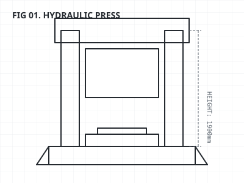
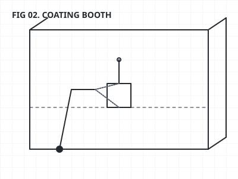

# 电脑机箱制造流程监控看板

围绕电脑机箱制造的 **冲压 → 喷涂 → 组装 → 质检 → 包装** 五道工序，制作一套从产线总览进入设备详情的浏览器交互原型。总览回答“各工序产量、节拍和合格率如何”，详情弹窗进一步展示冲压机、喷涂臂、装配工位等设备的示例参数。

**交付成果是一个无需安装依赖的单页看板：5 道工序、15 项设备/工位配置、5 张设备 SVG，以及每秒更新和启停切换的模拟交互。** 数据由浏览器生成，用于演示生产信息的查看方式。

## 做出了什么

| 功能 | 可观察的结果 | 证据入口 |
| --- | --- | --- |
| 五工序总览 | 同屏查看各工序产量、不良数、速度、节拍与合格率 | [页面结构](index.html)、[工序数据](js/app.js#L14) |
| 设备详情 | 点击工序，查看该工序下 3 项设备或工位的参数 | [详情配置](js/app.js#L23)、[弹窗逻辑](js/app.js#L219) |
| 动态模拟 | 运行状态下每秒更新模拟产量、速度与部分参数 | [更新逻辑](js/app.js#L134) |
| 启停反馈 | 点击停止后，暂停业务数据更新；再次启动后恢复 | [启停逻辑](js/app.js#L116) |
| 设备示意图 | 用冲压、喷涂、组装、质检和包装 SVG 配合参数阅读 | [设备图目录](images) |

界面使用的设备示意图（非实物照片）：

| 冲压设备 | 喷涂设备 |
| --- | --- |
|  |  |

## 一分钟查看路线

1. 下载项目，直接用浏览器打开 [index.html](index.html)。
2. 从左到右查看五道工序，观察产量、速度和节拍的模拟变化。
3. 点击冲压或喷涂工序，查看设备列表、工艺参数与设备示意图。
4. 关闭弹窗，点击“停止产线”，确认业务数据停止变化；再启动恢复演示。

暂停业务数据时，页面时钟仍会继续显示时间。

## 设计与实现

- **以工序组织信息。** 五道工序提供统一的指标结构，便于比较；设备参数放在详情弹窗，避免全部堆在总览上。
- **同一界面支持概览与追问。** 从工序卡片进入设备列表，可以继续查看冲次、压力、温度、扭矩、检测数量等示例参数。当前是“工序总览 → 详情弹窗”两层界面。
- **使用简单、可读的模拟方法。** JavaScript 定时修改数据并更新页面。工序合格率由模拟产量和不良数计算，节拍由模拟速度换算。
- **展示数据接入设想。** 详情用 PLC、网关、MES/SCADA 和协议名称说明该工序可能采用的数据来源与连接关系。

详细的数据口径、交互设计和实现边界见 [设计与实现说明](PROJECT_REPORT.md)。

## 公开文件与运行

```text
index.html          页面与详情弹窗
css/style.css       页面布局和样式
js/app.js           模拟数据、定时更新和交互
images/             五道工序的设备 SVG
PROJECT_REPORT.md   设计依据、数据口径与实现边界
```

使用现代桌面浏览器打开 `index.html` 即可，也可由任意静态文件服务器提供页面。项目没有第三方前端依赖和构建步骤。

## 当前边界

- 数据更新和启停均在浏览器内完成，未连接真实设备或数据库；协议名称属于展示内容，没有工业协议解析与通信。
- OEE 采用随机浮动；生产对比图、在制品数量和部分指标为预置数据。它们用于界面演示，不代表实际生产成绩。
- 当前界面为总览与详情两层，尚无四级下钻、预测性维护或可控故障注入；也没有报警响应时间和效率改善的测量结果。

仓库未附加开源许可证；公开源码的复用授权需由仓库所有者另行确认。
